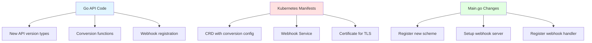

# Implementing Conversion Webhooks in Non-Operator-SDK Projects

This guide shows how to implement API version conversion webhooks in Kubernetes operators that don't use operator-sdk.

## Components Overview



## Step-by-Step Implementation

### Phase 1: Create New API Version

**Step 1: Create new API version directory**
```bash
# Assuming your existing API is api/v1alpha1/
mkdir -p api/v1beta1
```

**Step 2: Create `api/v1beta1/groupversion_info.go`**
```go
// api/v1beta1/groupversion_info.go
package v1beta1

import (
    "k8s.io/apimachinery/pkg/runtime/schema"
    "sigs.k8s.io/controller-runtime/pkg/scheme"
)

var (
    GroupVersion = schema.GroupVersion{Group: "your.domain.io", Version: "v1beta1"}
    SchemeBuilder = &scheme.Builder{GroupVersion: GroupVersion}
    AddToScheme = SchemeBuilder.AddToScheme
)
```

**Step 3: Create `api/v1beta1/yourresource_types.go`**
```go
// api/v1beta1/yourresource_types.go
package v1beta1

import (
    metav1 "k8s.io/apimachinery/pkg/apis/meta/v1"
)

// YourResourceSpec defines the desired state
type YourResourceSpec struct {
    // NEW structure - this is your v2 API design
    Field1 string `json:"field1,omitempty"`
    Field2 string `json:"field2,omitempty"`
}

// YourResourceStatus defines the observed state
type YourResourceStatus struct {
    // Your status fields
}

// +kubebuilder:object:root=true
// +kubebuilder:subresource:status
// +kubebuilder:storageversion

// YourResource is the Schema for the yourresources API
type YourResource struct {
    metav1.TypeMeta   `json:",inline"`
    metav1.ObjectMeta `json:"metadata,omitempty"`

    Spec   YourResourceSpec   `json:"spec,omitempty"`
    Status YourResourceStatus `json:"status,omitempty"`
}

// +kubebuilder:object:root=true

// YourResourceList contains a list of YourResource
type YourResourceList struct {
    metav1.TypeMeta `json:",inline"`
    metav1.ListMeta `json:"metadata,omitempty"`
    Items           []YourResource `json:"items"`
}

func init() {
    SchemeBuilder.Register(&YourResource{}, &YourResourceList{})
}
```

**Step 4: Create `api/v1beta1/yourresource_conversion.go`**
```go
// api/v1beta1/yourresource_conversion.go
package v1beta1

// Hub marks this type as a conversion hub (storage version)
func (*YourResource) Hub() {}
```

### Phase 2: Add Conversion Functions to Old Version

**Step 5: Create `api/v1alpha1/yourresource_conversion.go`**
```go
// api/v1alpha1/yourresource_conversion.go
package v1alpha1

import (
    "sigs.k8s.io/controller-runtime/pkg/conversion"
    "your-module/api/v1beta1"
)

// ConvertTo converts this v1alpha1 to the Hub version (v1beta1)
func (src *YourResource) ConvertTo(dstRaw conversion.Hub) error {
    dst := dstRaw.(*v1beta1.YourResource)

    // ObjectMeta
    dst.ObjectMeta = src.ObjectMeta

    // Spec conversion - adapt to your fields
    dst.Spec.Field1 = src.Spec.OldField1
    dst.Spec.Field2 = src.Spec.OldField2
    
    // Handle data transformations
    // e.g., flatten nested structures, rename fields, etc.

    // Status conversion
    // dst.Status = convertStatus(src.Status)

    return nil
}

// ConvertFrom converts from the Hub version (v1beta1) to this v1alpha1
func (dst *YourResource) ConvertFrom(srcRaw conversion.Hub) error {
    src := srcRaw.(*v1beta1.YourResource)

    // ObjectMeta
    dst.ObjectMeta = src.ObjectMeta

    // Spec conversion - reverse transformation
    dst.Spec.OldField1 = src.Spec.Field1
    dst.Spec.OldField2 = src.Spec.Field2

    // Status conversion
    // dst.Status = convertStatusBack(src.Status)

    return nil
}
```

### Phase 3: Register Webhook in Code

**Step 6: Create webhook setup file**
```go
// internal/webhook/yourresource_webhook.go  (or api/v1beta1/webhook.go)
package webhook

import (
    ctrl "sigs.k8s.io/controller-runtime"
    "your-module/api/v1beta1"
)

// SetupYourResourceWebhookWithManager registers the webhook
func SetupYourResourceWebhookWithManager(mgr ctrl.Manager) error {
    return ctrl.NewWebhookManagedBy(mgr).
        For(&v1beta1.YourResource{}).
        Complete()
}
```

**Step 7: Update `main.go`**
```go
// cmd/main.go or main.go
package main

import (
    "crypto/tls"
    "flag"
    "os"
    
    "k8s.io/apimachinery/pkg/runtime"
    utilruntime "k8s.io/apimachinery/pkg/util/runtime"
    clientgoscheme "k8s.io/client-go/kubernetes/scheme"
    ctrl "sigs.k8s.io/controller-runtime"
    "sigs.k8s.io/controller-runtime/pkg/webhook"
    
    yourv1alpha1 "your-module/api/v1alpha1"
    yourv1beta1 "your-module/api/v1beta1"
    "your-module/internal/webhook"
)

var (
    scheme = runtime.NewScheme()
)

func init() {
    utilruntime.Must(clientgoscheme.AddToScheme(scheme))
    
    // Register BOTH API versions
    utilruntime.Must(yourv1alpha1.AddToScheme(scheme))
    utilruntime.Must(yourv1beta1.AddToScheme(scheme))
}

func main() {
    var enableWebhook bool
    flag.BoolVar(&enableWebhook, "enable-webhook", true, "Enable webhook server")
    flag.Parse()

    // Configure webhook server
    webhookServer := webhook.NewServer(webhook.Options{
        Port: 9443,
        // TLS cert will be mounted at this path in production
        CertDir: "/tmp/k8s-webhook-server/serving-certs",
    })

    mgr, err := ctrl.NewManager(ctrl.GetConfigOrDie(), ctrl.Options{
        Scheme:        scheme,
        WebhookServer: webhookServer,
        // ... other options
    })
    if err != nil {
        panic(err)
    }

    // Setup your controller
    // if err := setupController(mgr); err != nil { ... }

    // Setup webhook
    if enableWebhook {
        if err := webhook.SetupYourResourceWebhookWithManager(mgr); err != nil {
            panic(err)
        }
    }

    if err := mgr.Start(ctrl.SetupSignalHandler()); err != nil {
        panic(err)
    }
}
```

### Phase 4: Generate DeepCopy and Update CRD

**Step 8: Update `go.mod` and add build tags**

Create or update `api/v1beta1/zz_generated.deepcopy.go`:
```bash
# If you have controller-gen installed
controller-gen object:headerFile="hack/boilerplate.go.txt" paths="./api/..."
```

Or add this comment to your types file:
```go
// +kubebuilder:object:generate=true
```

**Step 9: Generate/Update CRD with conversion webhook**

If using controller-gen:
```bash
controller-gen crd:crdVersions=v1 paths="./api/..." output:crd:artifacts:config=config/crd/bases
```

Or manually create/update your CRD YAML.

### Phase 5: Kubernetes Manifests

**Step 10: Update CRD with conversion webhook config**
```yaml
# config/crd/bases/your.domain.io_yourresources.yaml
apiVersion: apiextensions.k8s.io/v1
kind: CustomResourceDefinition
metadata:
  name: yourresources.your.domain.io
spec:
  group: your.domain.io
  names:
    kind: YourResource
    plural: yourresources
  scope: Namespaced
  
  # IMPORTANT: Add conversion configuration
  conversion:
    strategy: Webhook
    webhook:
      clientConfig:
        service:
          namespace: your-operator-namespace
          name: your-webhook-service
          path: /convert
        # caBundle will be injected by cert-manager
      conversionReviewVersions:
        - v1
  
  versions:
    - name: v1alpha1
      served: true
      storage: false  # OLD version, not storage
      schema:
        openAPIV3Schema:
          # ... your v1alpha1 schema
      
    - name: v1beta1
      served: true
      storage: true  # NEW version, this is storage version
      schema:
        openAPIV3Schema:
          # ... your v1beta1 schema
```

**Step 11: Create webhook Service**
```yaml
# config/webhook/service.yaml
apiVersion: v1
kind: Service
metadata:
  name: your-webhook-service
  namespace: your-operator-namespace
spec:
  ports:
    - port: 443
      targetPort: 9443
      protocol: TCP
  selector:
    app: your-operator  # Match your operator's pod labels
```

**Step 12: Create Certificate (if using cert-manager)**
```yaml
# config/certmanager/certificate.yaml
apiVersion: cert-manager.io/v1
kind: Certificate
metadata:
  name: your-serving-cert
  namespace: your-operator-namespace
spec:
  dnsNames:
    - your-webhook-service.your-operator-namespace.svc
    - your-webhook-service.your-operator-namespace.svc.cluster.local
  issuerRef:
    kind: Issuer
    name: your-selfsigned-issuer
  secretName: webhook-server-cert
---
apiVersion: cert-manager.io/v1
kind: Issuer
metadata:
  name: your-selfsigned-issuer
  namespace: your-operator-namespace
spec:
  selfSigned: {}
```

**Step 13: Update Deployment to mount certificate**
```yaml
# config/deployment.yaml (or similar)
apiVersion: apps/v1
kind: Deployment
metadata:
  name: your-operator
  namespace: your-operator-namespace
spec:
  template:
    spec:
      containers:
        - name: manager
          image: your-operator:latest
          ports:
            - containerPort: 9443
              name: webhook-server
              protocol: TCP
          volumeMounts:
            - mountPath: /tmp/k8s-webhook-server/serving-certs
              name: cert
              readOnly: true
      volumes:
        - name: cert
          secret:
            secretName: webhook-server-cert
```

**Step 14: Annotate CRD for CA injection (if using cert-manager)**
```yaml
# Add annotation to CRD
apiVersion: apiextensions.k8s.io/v1
kind: CustomResourceDefinition
metadata:
  name: yourresources.your.domain.io
  annotations:
    cert-manager.io/inject-ca-from: your-operator-namespace/your-serving-cert
spec:
  # ... rest of CRD
```

### Phase 6: Build and Test

**Step 15: Build**
```bash
# Generate code
go generate ./...

# Build
go build -o bin/manager main.go

# Build Docker image
docker build -t your-operator:latest .
```

**Step 16: Deploy**
```bash
# Install cert-manager (if not already)
kubectl apply -f https://github.com/cert-manager/cert-manager/releases/download/v1.16.2/cert-manager.yaml

# Apply CRDs
kubectl apply -f config/crd/bases/

# Apply webhook service and certificate
kubectl apply -f config/webhook/
kubectl apply -f config/certmanager/

# Deploy operator
kubectl apply -f config/deployment.yaml
```

**Step 17: Test conversion**
```bash
# Create v1alpha1 resource
kubectl apply -f - <<EOF
apiVersion: your.domain.io/v1alpha1
kind: YourResource
metadata:
  name: test-conversion
spec:
  oldField1: value1
  oldField2: value2
EOF

# Get as v1beta1 (should be converted)
kubectl get yourresources.v1beta1.your.domain.io test-conversion -o yaml
```

## Files Checklist

### New Files to Create:
- [ ] `api/v1beta1/groupversion_info.go`
- [ ] `api/v1beta1/yourresource_types.go`
- [ ] `api/v1beta1/yourresource_conversion.go`
- [ ] `api/v1beta1/zz_generated.deepcopy.go` (generated)
- [ ] `api/v1alpha1/yourresource_conversion.go`
- [ ] `internal/webhook/yourresource_webhook.go`
- [ ] `config/webhook/service.yaml`
- [ ] `config/certmanager/certificate.yaml`

### Files to Modify:
- [ ] `main.go` - Register v1beta1 scheme and webhook
- [ ] `config/crd/bases/yourresource.yaml` - Add conversion section
- [ ] `config/deployment.yaml` - Add webhook port and cert volume
- [ ] `go.mod` - Run `go mod tidy`

## Key Differences from Operator SDK

| Aspect | Operator SDK | Manual |
|--------|--------------|--------|
| Scaffolding | `operator-sdk create api/webhook` | Create files manually |
| Code generation | Automatic | Run `controller-gen` manually |
| Kustomize | Pre-configured | Manual setup |
| Markers | Added automatically | Add `+kubebuilder` comments yourself |

## Important Notes

1. **Storage Version**: Only ONE version can have `storage: true` in the CRD. This is the "Hub" version.

2. **Hub Interface**: The storage version must implement `Hub()` - this is just an empty marker method.

3. **Convertible Interface**: Non-storage versions must implement:
   - `ConvertTo(hub conversion.Hub) error`
   - `ConvertFrom(hub conversion.Hub) error`

4. **Conversion Direction**: All conversions go through the Hub:
   - v1alpha1 → v1beta1 (Hub)
   - v1alpha2 → v1beta1 (Hub)
   - v1beta1 is never converted (it's the Hub)

5. **Webhook Path**: The path `/convert` is standard and handled by controller-runtime automatically.

6. **TLS Certificates**: Required for webhooks. Use cert-manager in production, self-signed certs for local dev.

7. **API Server Communication**: The Kubernetes API server calls your webhook synchronously during resource admission.

## Troubleshooting

**Webhook not being called:**
- Check CRD has `conversion.strategy: Webhook`
- Verify webhook Service selector matches pod labels
- Check cert-manager injected CA bundle into CRD
- Look at operator logs for webhook server startup

**Certificate errors:**
- Ensure cert-manager is installed and running
- Verify Certificate resource created successfully
- Check Secret `webhook-server-cert` exists
- Confirm CRD annotation `cert-manager.io/inject-ca-from` is correct

**Conversion failures:**
- Check operator logs for conversion errors
- Ensure both API versions are registered in scheme
- Verify ConvertTo/ConvertFrom logic is correct
- Test conversion functions with unit tests

**Image pull errors in local cluster:**
- Set `imagePullPolicy: Never` in deployment
- Load image into cluster: `kind load docker-image your-image:tag`

## Testing Conversion Locally

For local development without a cluster:

```go
// conversion_test.go
func TestConversion(t *testing.T) {
    v1alpha1Obj := &v1alpha1.YourResource{
        Spec: v1alpha1.YourResourceSpec{
            OldField1: "value1",
        },
    }
    
    v1beta1Obj := &v1beta1.YourResource{}
    
    err := v1alpha1Obj.ConvertTo(v1beta1Obj)
    assert.NoError(t, err)
    assert.Equal(t, "value1", v1beta1Obj.Spec.Field1)
    
    // Test round-trip
    v1alpha1Back := &v1alpha1.YourResource{}
    err = v1alpha1Back.ConvertFrom(v1beta1Obj)
    assert.NoError(t, err)
    assert.Equal(t, "value1", v1alpha1Back.Spec.OldField1)
}
```

## References

- [Kubernetes API Versioning](https://kubernetes.io/docs/reference/using-api/#api-versioning)
- [controller-runtime Conversion Webhooks](https://book.kubebuilder.io/multiversion-tutorial/conversion.html)
- [CRD Conversion Webhook](https://kubernetes.io/docs/tasks/extend-kubernetes/custom-resources/custom-resource-definition-versioning/#webhook-conversion)

The core logic is the same as operator-sdk - you're implementing the `conversion.Hub` and `conversion.Convertible` interfaces that controller-runtime expects!
