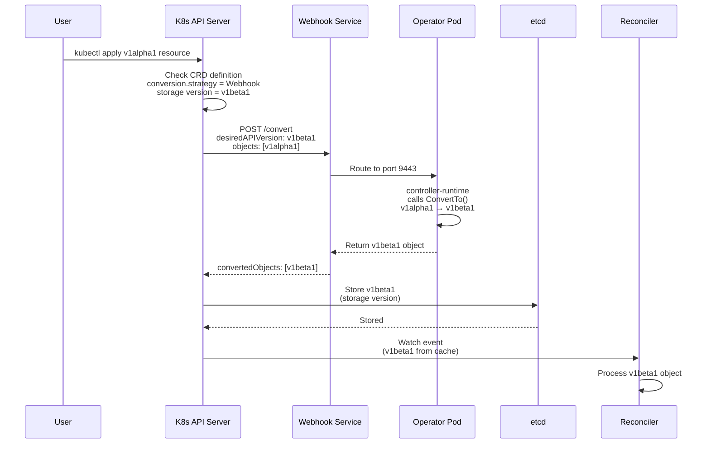
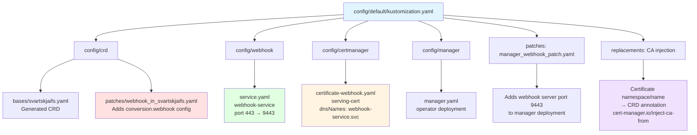
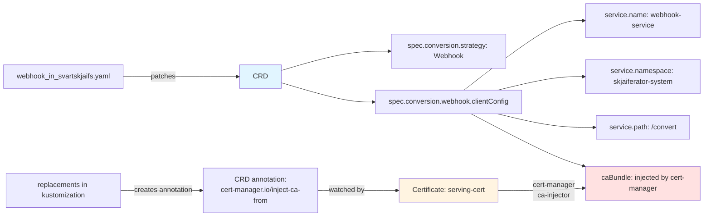
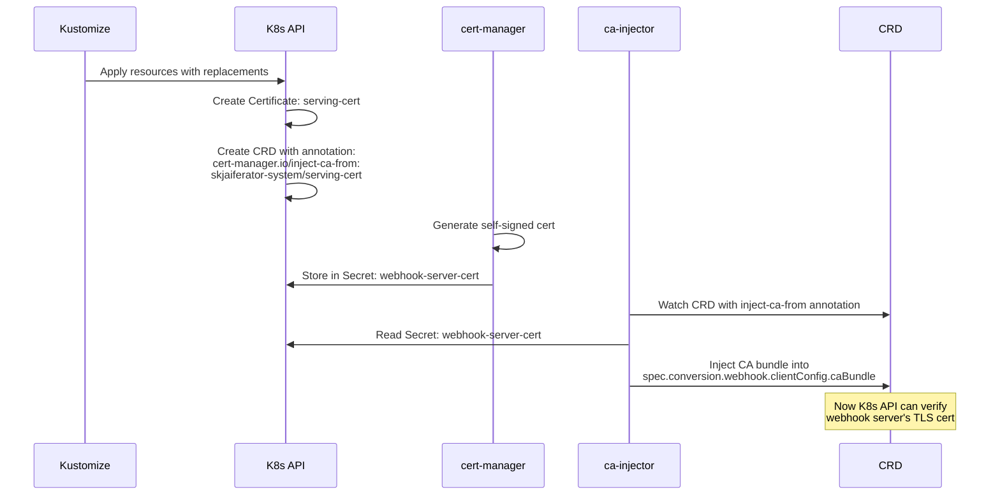
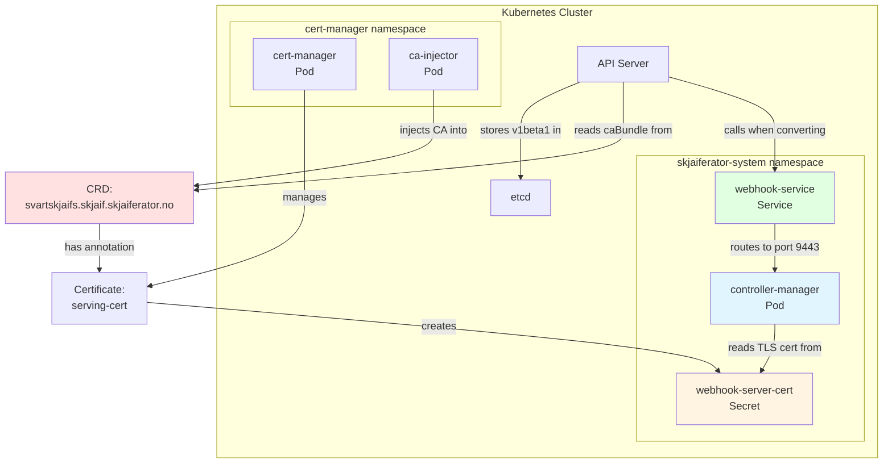
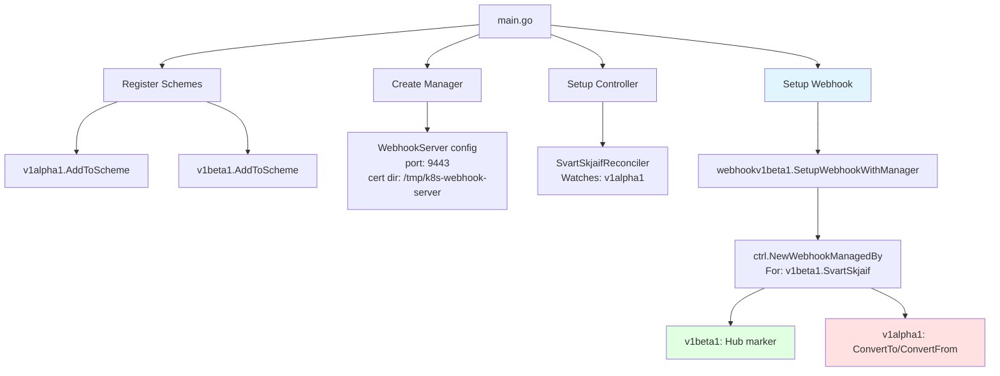

# Conversion Webhook Flow Diagrams

## 1. Runtime Flow: v1alpha1 → v1beta1 Conversion

## 2. Kustomize Configuration Chain

## 3. CRD Conversion Configuration Flow

## 4. Cert-Manager CA Injection Flow

## 5. Component Connections

## 6. Code Registration in main.go

## Key Files and Their Roles

| File | Purpose |
|------|---------|
| `api/v1alpha1/svartskjaif_conversion.go` | Implements `ConvertTo()` and `ConvertFrom()` |
| `api/v1beta1/svartskjaif_conversion.go` | Implements `Hub()` marker (storage version) |
| `config/crd/patches/webhook_in_svartskjaifs.yaml` | Adds conversion webhook config to CRD |
| `config/webhook/service.yaml` | Creates webhook Service (routes to operator) |
| `config/certmanager/certificate-webhook.yaml` | Requests TLS cert from cert-manager |
| `config/default/kustomization.yaml` | Orchestrates everything with replacements |
| `internal/webhook/v1beta1/svartskjaif_webhook.go` | Registers webhook with controller-runtime |
| `cmd/main.go` | Wires everything together at runtime |

